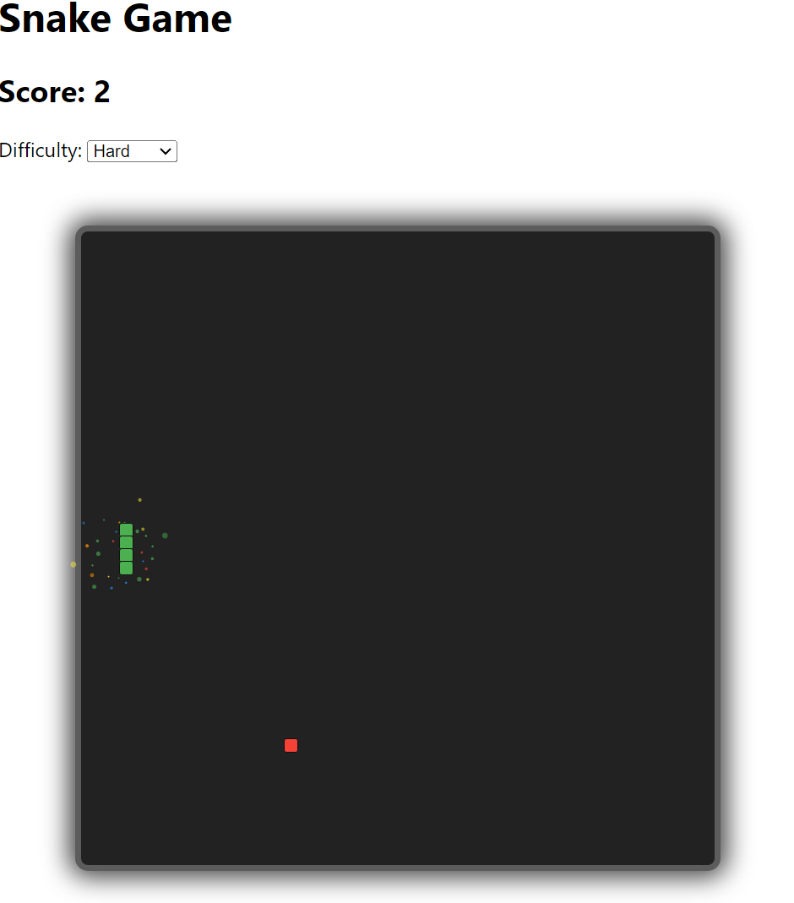

# Getting Started Snake-GPT

## Quick View

[https://snake-gpt.netlify.app/#/](https://snake-gpt.netlify.app/)

## About the project

Just a little project I spent a few evenings messing around on to see how far I could take ChatGPT and how easy it would be to make a game purely from generated code.
I was also comparing the responses from ChatGPT3 and ChatGPT4.
I tried to create the init games with the most basic rules using a single prompt. When I had the basic game in place I then crafted additional promots to generate code for more specific features which I think handled reasonably well.
Overall this is not a very serious project or a show of skill but I wanted to add it as I thought the actual outcome was interesting and the process was insightful.

## Available Scripts

In the project directory, you can run:

### `npm i`

### `npm start`

Runs the app in the development mode.\
Open [http://localhost:3000](http://localhost:3000) to view it in your browser.

The page will reload when you make changes.\
You may also see any lint errors in the console.

